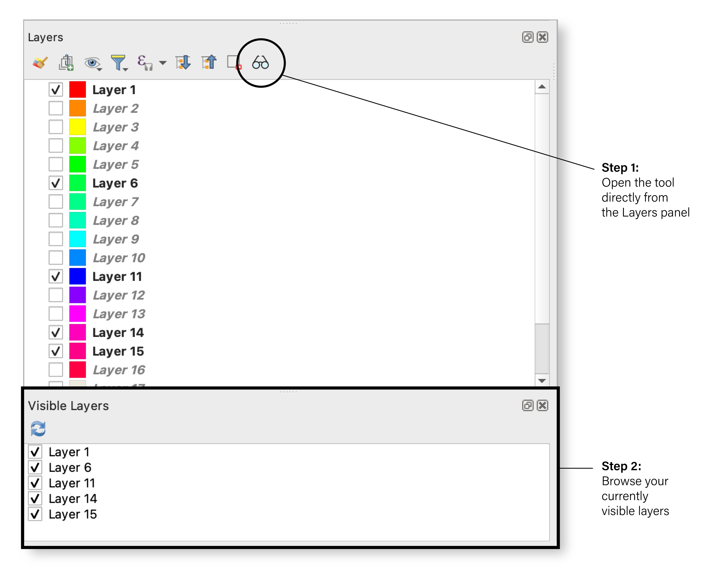

<h1> Visible Layers</h1>

Visible Layers is a lightweight plugin for QGIS that displays only the layers currently visible (toggled) in your project, inside a dedicated dock panel.

It enhances readability and efficiency when working with complex projects by allowing users to focus solely on the layers that matter.
## Features

- Show only visible layers (i.e., checked in the Layers Panel)
- Toggle the panel using a toolbar button directly inside the Layers Panel
- Auto-refresh when opening a new QGIS project
- Refresh manually if needed using a "Refresh" button
- Click a layer in the dock to select it in the Layers Panel
- Double-click a layer to open its Layer Properties dialog
- Synchronize visibility: checking/unchecking a layer in the dock updates the main panel
- Preserves layer order and integrates without affecting your project structure
- Uses SVG icons, native QGIS styling, and no external dependencies

## Typical use cases

- Quickly scan only the layers that are currently shown on the map
- Declutter your interface when navigating complex projects with many utility/background layers
- Share a screenshot or perform visual analysis with only relevant layers visible
- Stay focused when toggling themes, temporal layers, or mapsheets

## How to use the plugin


Only the checked layers are listed in the "Visible Layers" panel for quick access and editing.

## Installation

1. Download or clone this repository  
2. Place the folder in your QGIS plugin directory:
   ```
   ~/.local/share/QGIS/QGIS3/profiles/default/python/plugins/
   ```
   Or on macOS:
   ```
   ~/Library/Application Support/QGIS/QGIS3/profiles/default/python/plugins/
   ```
3. Restart QGIS and enable the plugin via Plugins > Manage and Install Plugins

## Compatibility and license

Compatible with QGIS 3.0+, licensed under GPL v2.  

## About

This tiny plugin was developed to support day-to-day GIS workflows with clarity and simplicity. Since I now use it in all my own projects, I thought it might be worth sharing.

## Feedback & contributions

Feel free to open issues or suggest improvements via pull request.  
If you found this useful, consider starring the repo or sharing it with the QGIS community.
